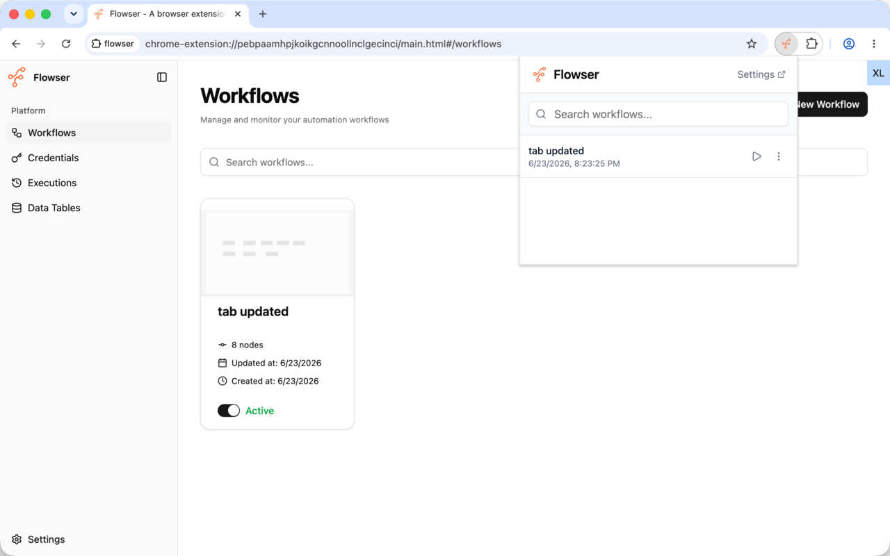
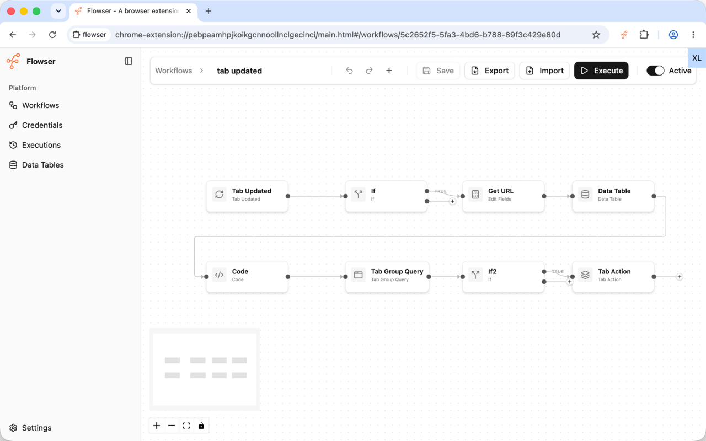
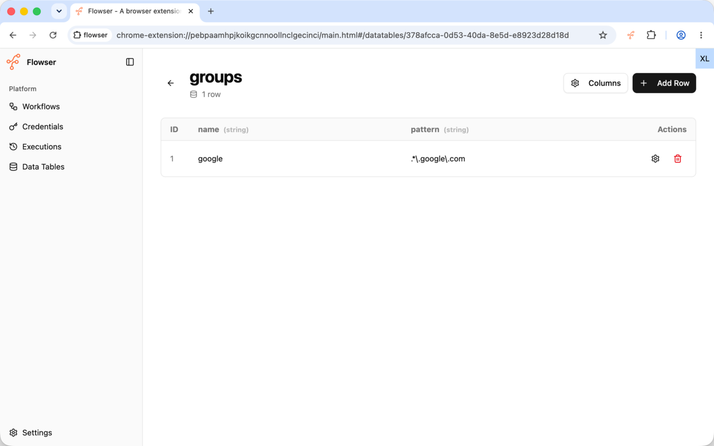
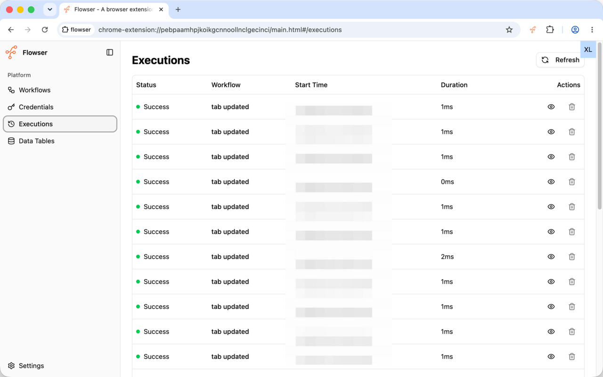
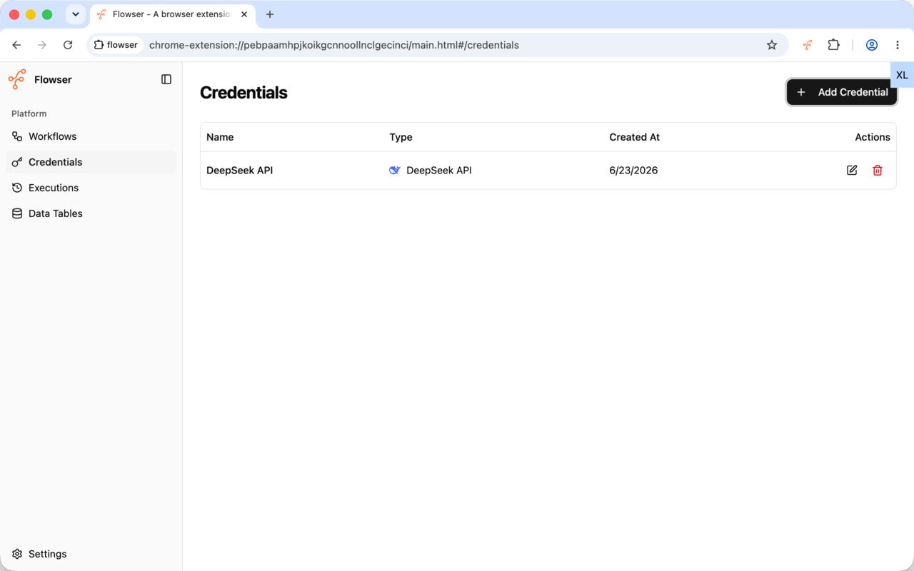
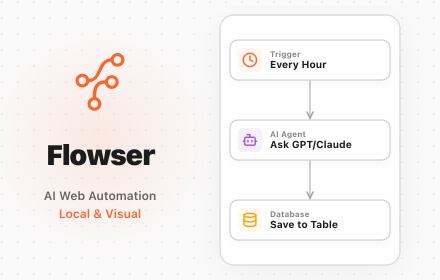
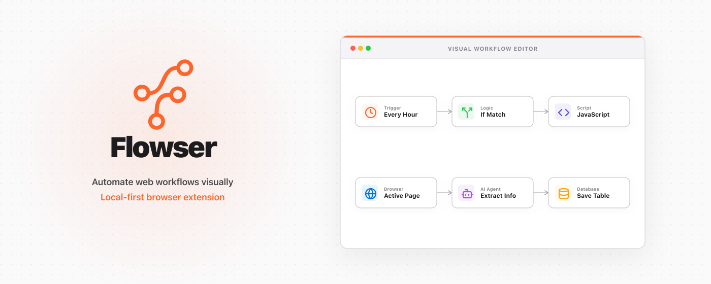

# Store listing

## Title

Flowser - AI Web Workflow Automation

## Summary from package

Flowser - A browser extension for automating web workflows with AI

## Description

Features:

- Visual Workflow Editor
  - Build and manage workflows using a drag-and-drop node-based editor
- AI Integration
  - Interact with Google Gemini, OpenAI GPT, Anthropic Claude, and DeepSeek models
  - Build smart automations using custom prompts
- Browser Automation
  - Query browser tabs based on patterns, status, and active states
  - Perform actions on tabs (create, close, group)
  - Create, query, and close browser windows
  - Trigger workflows automatically on tab events (tab created, tab updated)
- Web Page Actions
  - Interact with page elements: Click elements via CSS selectors or XPath
  - Wait for elements to load or pause execution
  - Fetch page content (text or HTML) for data scraping or extraction
- Data and Advanced Operations
  - Execute custom JavaScript code within workflows using sandboxed JS execution
  - Organize and store retrieved data into local Data Tables (supporting CRUD operations)
  - Branch workflows with flexible conditional (IF) logic
  - Manipulate and transform item fields (mapping, merging, keeping specific properties)
- Automation Scheduling
  - Trigger workflows manually
  - Schedule recurring executions using cron expressions
- Security and Privacy First
  - All data and workflows run locally in your browser
  - Sensitive API keys and credentials are encrypted using a Master Password
- Free and open source - <https://github.com/tomowang/flowser>

## Category

Tools

## Language

English (United States)

## Store icon

## Screenshots

## Small promo tile

## Marquee promo tile

# Privacy

## Single purpose

AI-assisted Web Workflow Automation

## Permission justification

- **storage**: Required to save user-defined workflows, local database tables (Data Tables) for scraping results, application preferences, execution history logs, and encrypted AI service credentials/API keys securely on the user's device. All data is stored locally.
- **tabs**: Required to query, create, close, and manage tabs within user-defined workflows, as well as to listen to tab events (e.g., tab created, updated, or closed) to trigger workflows automatically.
- **activeTab**: Required to interact with the currently active tab securely to perform page-level automations (e.g., clicking elements, waiting for elements, or scraping page contents) when a workflow is active.
- **tabGroups**: Required to programmatically organize, group, ungroup, and label browser tabs within automated workflows according to user-configured rules.
- **alarms**: Required to schedule and execute background workflows automatically at specific times or recurring intervals (using cron expressions).
- **Host Permission (`<all_urls>`)**: Required to interact with page elements (injecting content scripts to scrape text/HTML or click selectors) on any target website configured by the user, and to make API requests to configured AI model providers (e.g., Google Gemini, OpenAI, Anthropic, DeepSeek).
- **scripting**: Required to run user-configured workflow steps that interact with the active page's DOM — clicking elements, filling in form fields, reading page text/HTML for scraping, and polling for an element's appearance. Each workflow node injects a short-lived script into the target tab only while that step is executing.
- **webRequest**: Required by the "Wait For Resource" workflow node to pause a workflow until a specific network request the page makes (matched by URL and method, as configured by the user) has completed, before continuing to the next step. Only request metadata (URL, method, timing) is inspected; no request or response bodies are read or modified.

## Data usage

None
